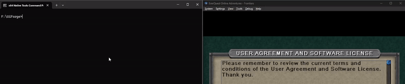

<h1 align="center">User Interface Forge</h1>
<p align="center">
  <a href="https://github.com/mmvest/user-interface-forge/blob/master/LICENSE">
    
  </a>
  <br>
A framework for injecting and managing custom UI elements in Windows Processes.
</p>

## Overview

User Interface Forge (UiForge) is a tool for injecting and managing custom UI elements in any Windows GUI applications using DirectX 11. The framework provides a means whereby users can create their own UI elements using the [ImGui](https://github.com/ocornut/imgui) library and then have their UI elements rendered in the application. Since your code will be running within the address space of the target process, you also have access to that address space meaning you can expose variables and addresses within the process that you can then access, display, or manipulate via your ImGui UI. This tool is ideal for developers or hobbyists who want to extend or modify the behavior of existing software, such as games or graphical applications.

UiForge has three main parts:
1. **[ImGui Lua Bindings (sol_ImGui.h)](include/imgui/sol_ImGui.h)** - These bindings provide access to ImGui's functionality in Lua so you can write and create your own UI elements in Lua instead of C/C++. I have unofficially dubbed these Lua scripts as "ForgeScripts".

1. **The Core (uif_core.dll)** - This is responsible for loading, running, and managing all of the Lua scripts. It is also responsible for hooking the correct graphics api functions so that the custom UI can be displayed within the context of the target application.

1. **The Injector (UiForge.exe)** - This is responsible for getting the uif_core DLL into the target application and starting it.

Currently this project only supports 64-bit DirectX11, but the goal is to support DirectX12, OpenGL, and Vulkan.

<div align="center">

⚠️ **WARNING: Use this code at your own risk. Only place trusted, non-malicious scripts in the scripts directory. This code will load any scripts found there, including potentially harmful ones. Intended for educational purposes and UI modding of retro/classic games or personal development projects. The injector may be marked as malware by Windows Defender since this uses a VERY common injection technique. I also recommend NOT using this while any form of anti-cheat is running, as you may get caught/banned. This is not meant to circumvent anti-cheat.** ⚠️

</div>

## Requirements
- **[Windows OS](https://www.microsoft.com/software-download/windows11)**: This tool is designed for Windows environments only. So far the tool has only been tested on Windows 11 but I suspect it should work on 64-bit Windows 7 and 10 as well.

- **[Windows SDK](https://developer.microsoft.com/en-us/windows/downloads/windows-sdk/)**: Must have `vcvars64.bat` and `cl` for compiling the code.

- **[DirectX SDK](https://learn.microsoft.com/en-us/windows/win32/directx-sdk--august-2009-)**: Included with the Windows SDK


## Building

1. **Clone the Repository**:
    ```bash
    git clone https://github.com/mmvest/User-Interface-Forge.git
    cd user-interface-forge
    ```

2. **Build**:

    To build, use the [build_uiforge.bat](build_uiforge.bat) script found in the root of the project. You can invoke the build like so:
    ```bash
    build_uiforge.bat
    ```

    This will build all the components of the application and place them in the `bin` directory. The main executable will be called **UiForge.exe**.

You are now all set to use UiForge!

> **Note:** Just another friendly reminder that anti-virus software may flag `UiForge.exe` as a virus. This is because the code uses a very classic and simple process injection technique -- and it is not very sneaky about it either. Go ahead and look over the code though -- it is not malicious.

## How to Use UiForge
Once UiForge is built, you can run it from the commandline like so
```bash
UiForge.exe <target_application_name>
```
As long as the application is actively rendering frames using a supported graphics api, you should see a demo window pop up. Here is an example of injecting UiForge into a running pcsx2 emulator:



To stop UiForge, just press the END key. Upon hitting the END key, a dialog box should pop up telling you that UiForge has cleaned up.

As of right now, there is no way to change this keybind except by changing the code itself, but I plan to add the ability to manage keybinds in the future. 

Note that NOT closing this dialog box and then attempting to re-inject may cause UiForge to fail.

UiForge requires a specific file structure to function properly. By default, the following structure is expected:
```
project-root/
├── UiForge.exe     # The actual executable to run
├── config          # Configuration file for UiForge 
├── bin/ 
│ └── uif_core.dll  # Core DLL for UiForge 
└── scripts/        # Directory for Lua scripts to be loaded and run 
  ├── modules/      # Subdirectory for custom libraries or modules
  └── resources/    # Subdirectory containing images and other resources for UiForge and scripts.
```
This structure is fully configurable through the `config` file, allowing you to customize the locations of the core DLL, scripts, and modules to suit your project setup.

## Lua Script Integration and Features

UiForge simplifies the management and creation of custom injected UI elements by providing you with the tools to make your UI through Lua-based scripts. Here’s how it works:

- **Effortless Script Loading**: Place your Lua scripts in the `scripts` directory. UiForge automatically executes them every frame in the target application, regardless of whether the scripts uses the ImGui bindings or not.

- **Integrated Rendering**: UI elements are rendered directly within the target application's graphics API render loop.

- **Streamlined ImGui Usage**: You don’t need to handle ImGui contexts or frame setup. Simply focus on defining your windows using `ImGui.Begin()`, `ImGui.End()`, and the code in between.

- **Powered by LuaJIT**: UiForge uses LuaJIT, which is Lua 5.1 compatible and provides extensive features for high-performance scripting. See the [LuaJIT documentation](https://luajit.org/) for more details.

- **Global ImGui Bindings**: Lua ImGui bindings (powered by [Sol2](https://github.com/ThePhD/sol2)) are globally exposed, so there’s no need to require or load additional DLLs or modules.

- **Type Hint Support**: An `imgui.lua` file, located in `scripts\modules\imgui`, provides type hints for most supported functions. While not exhaustive or perfect, it offers a helpful guide. For a full list of supported functions, refer to `include/imgui/sol_ImGui.h`.

- **Custom Modules**: Use the `scripts\modules` directory to add any custom libraries or lua modules you want to access in your scripts.

- **Example Script**: The [`test_window_01.lua`](scripts/test_window_01.lua) and [`test_window_02.lua`](scripts/test_window_01.lua) files demonstrate basic use cases for the ImGui bindings and UiForge, serving as a helpful starting point.

- **Static Linking for Simplicity**: All third-party dependencies (ImGui, Kiero, LuaJIT, etc.) are statically linked into UiForge. This eliminates the need to manage DLLs or download and install additional libraries. All libraries required for the build can be found in the [`libs`](libs) folder.

- **Customizable Configurations**: Various configurations are exposed through the `config` file, enabling customization of script and module directories, the location of the core DLL, and more.

## Examples: UiForge in Action

Examples are incoming -- currently working on a project that will be using this!

## Roadmap
The current implementation is what I would call a rough draft or proof of concept to show that it can be done and to get my other project off the ground. Here are the remaining goal marks for the project. 
- **v0.4.0** - Control (settings) panel fully implemented, allowing the user to enable/disable and load/unload/reload scripts. Also allows scripts to register a settings callback to expose values/settings for the user to configure. Also display debug information abotu the scripts (e.g. time to execute, memory used, etc.).

- **v0.5.0** - Add a basic in-app lua editor, allowing you to edit scripts, create new scripts, and run the scripts in whatever app UiForge is injected into. Attempt to "sandbox" this enough as to prevent crashing the application if something goes wrong.

- **v0.6.0** - Add support for DirectX12, Vulkan, and OpenGL.

- **v1.0.0** - Everything is nice and polished! All systems functioning adequately, code/commenting styling consistent across all modules, common errors and bugs handled and logged appropriately, general code cleanup, documentation completed, etc.

## Contributing

Contributions are welcome! I am very new to C++ (all my professional experience is in C) so I am open to suggestions, advice, or criticism that will help me improve. Currently the code is a hodgepodge of what I would call "C"-isms and "C++"-isms. I'd like to clean it up as I learn more about C++ and OOP. 

Please open an issue or submit a pull request for any features or fixes you'd like to see.

## License

This project is licensed under the MIT License. See the [LICENSE](LICENSE.txt) file for details.

## Acknowledgements

- **[Dear ImGui](https://github.com/ocornut/imgui)** - The graphics library 
- **[Kiero Library](https://github.com/Rebzzel/kiero)** - Graphics API hooking library
- **[MinHook](https://github.com/TsudaKageyu/minhook)** - Used by Kiero for hooking
- **[Sol2](https://github.com/ThePhD/sol2)** - C++/Lua binding library
- **[plog](https://github.com/SergiusTheBest/plog)** - Logging framework
- **[SCL](https://github.com/WizardCarter/simple-config-library)** - config library
- **[sol2_ImGui-Bindings](https://github.com/Fesmaster/sol2_ImGui_Bindings)** - Original bindings I pulled from. I have forked the repo and made changes. The changes can be found at https://github.com/mmvest/sol2_ImGui_Bindings.

## Disclaimer

This tool is for educational and developmental purposes only. Use at your own risk and ensure you have the right to modify the target application. I am not responsible for how users choose to utilize this tool. This includes, but is not limited to, any consequences of:

- Being banned from games, platforms, or services.
- Running malicious Lua scripts using UiForge.

By using this tool, you accept full responsibility for your actions and any outcomes that may result.